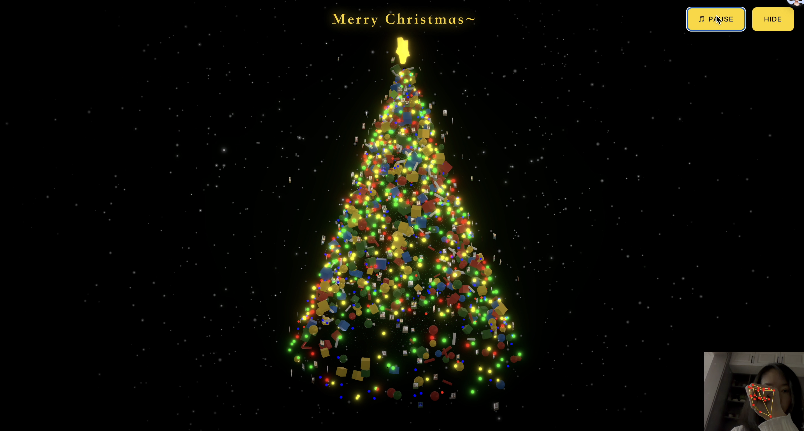
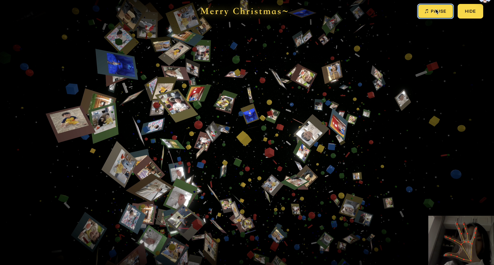

# 🎄 Grand Luxury Interactive 3D Christmas Tree

> 一个基于 **React**, **Three.js (R3F)** 和 **AI 手势识别** 的高保真 3D 圣诞树 Web 应用。

这个项目不仅仅是一棵树，它是一个承载记忆的交互式画廊。成百上千个粒子、璀璨的彩灯和悬浮的拍立得照片共同组成了一棵奢华的圣诞树。用户可以通过手势控制树的形态（聚合/散开）和视角旋转，体验电影级的视觉盛宴。





## ✨ 核心特性

* **极致视觉体验**：由 45,000+ 个发光粒子组成的树身，配合动态光晕 (Bloom) 和辉光效果，营造梦幻氛围。
* **记忆画廊**：照片以“拍立得”风格悬浮在树上，每一张都是一个独立的发光体，支持双面渲染。
* **AI 手势控制**：无需鼠标，通过摄像头捕捉手势即可控制树的形态（聚合/散开）和视角旋转。
* **丰富细节**：包含动态闪烁的彩灯、飘落的金银雪花、以及随机分布的圣诞礼物和糖果装饰。
* **高度可定制**：**支持用户轻松替换为自己的照片，并自由调整照片数量。**

## 🛠️ 技术栈

* **框架**: React 18, Vite
* **3D 引擎**: React Three Fiber (Three.js)
* **工具库**: @react-three/drei, Maath
* **后期处理**: @react-three/postprocessing
* **AI 视觉**: MediaPipe Tasks Vision (Google)

## 🚀 快速开始

### 1. 环境准备

确保你的电脑已安装 [Node.js](https://nodejs.org/) (建议 v18 或更高版本)。

### 2. 安装依赖

在项目根目录下打开终端，运行：```bash npm install

### 3. 启动项目

npm run dev

### 🖼️ 自定义照片

### 1. 准备照片

找到项目目录下的 public/photos/ 文件夹。

顶端大图/封面图：命名为 top.jpg（将显示在树顶的立体五角星上）。

树身照片：命名为 1.jpg, 2.jpg, 3.jpg ... 依次类推。

建议：使用正方形或 4:3 比例的图片，文件大小不宜过大（建议单张 500kb 以内以保证流畅度）

### 2. 替换照片

直接将你自己的照片复制到 public/photos/ 文件夹中，覆盖原有的图片即可。请保持文件名格式不变（1.jpg, 2.jpg 等）。

### 3. 修改照片数量 (增加或减少)

如果你放入了更多照片（例如从默认的 31 张增加到 100 张），需要修改代码以通知程序加载它们。
打开文件：src/App.tsx
找到大约 第 19 行 的代码：// --- 动态生成照片列表 (top.jpg + 1.jpg 到 31.jpg) ---
const TOTAL_NUMBERED_PHOTOS = 31; // <--- 修改这个数字！

### 🖐️ 手势控制说明

* **本项目内置了 AI 手势识别系统，请站在摄像头前进行操作（屏幕右下角有 DEBUG 按钮可查看摄像头画面）**：

| 手势                      | 功能     | 说明                                   |
| ------------------------- | -------- | -------------------------------------- |
| 🖐 张开手掌 (Open Palm)   | 散开模式 | 圣诞树炸裂成漫天飞舞的粒子和照片       |
| ✊ 握紧拳头 (Closed Fist) | 聚合模式 | 所有元素瞬间聚合成一棵完美的圣诞树     |
| 👋 手掌左右移动           | 旋转视角 | 手向左移，树向左转；手向右移，树向右转 |

#### 📸 捏合手势查看照片

1. **捏合手指（食指+拇指）** - 随机打开一张照片大图
2. **保持捏合** - 大图持续显示
3. **松开手指** - 自动关闭大图，返回3D场景

> 💡 提示：任何时候捏合手指都可以随机查看一张照片，简单又有趣！

### ⚙️ 进阶配置

* **如果你熟悉代码，可以在 src/App.tsx 中的 CONFIG 对象里调整更多视觉参数**：
  const CONFIG = {
  colors: { ... }, // 修改树、灯光、边框的颜色
  counts: {
  foliage: 15000,   // 修改树叶粒子数量 (配置低可能会卡)
  ornaments: 300,   // 修改悬挂的照片/拍立得数量
  lights: 400       // 修改彩灯数量
  },
  tree: { height: 22, radius: 9 }, // 修改树的大小
  // ...
  };

### 📄 License

MIT License. Feel free to use and modify for your own holiday celebrations!

### Merry Christmas! 🎄✨

## 🙏 致谢 / Acknowledgements

本项目基于 **[moleculemmeng020425/christmas-tree](https://github.com/moleculemmeng020425/christmas-tree)** 进行二次开发。

感谢原作者提供的精彩 3D 圣诞树实现！在此基础上，我们进行了以下优化与定制：
*   **功能新增**：增加了图片点击放大交互，支持手势捏合查看大图细节。
*   **视觉升级**：重构了彩蛋粒子效果，调整了整体配色与氛围。
*   **交互优化**：平滑了动画过渡，优化了手势识别反馈。
*   **细节打磨**：修正了部分 UI 布局与性能问题。

## 📝 更新日志

### 2025-12-20 优化更新

* **全新彩蛋体验**：将图片打开时的彩蛋效果重构为“彩色纸屑炸开”——从屏幕中心向四周爆发五颜六色的彩纸（红/黄/蓝/绿/紫/青/橙），模拟真实的礼炮庆祝效果。
* **交互体验升级**：实现了图片和背景粒子在关闭时的同步渐隐（Fade-out）效果，消除了瞬间消失的突兀感。
* **视觉一致性**：统一了彩蛋粒子的配色方案，解决了不同图片对应效果风格不统一的问题。
* **粒子效果优化**：针对新风格微调了粒子大小（0.4）和数量（200），确保“纸屑”清晰可见且不杂乱。
* **界面调整**：顶部标题更新为简洁的 “Merry Christmas~”。
